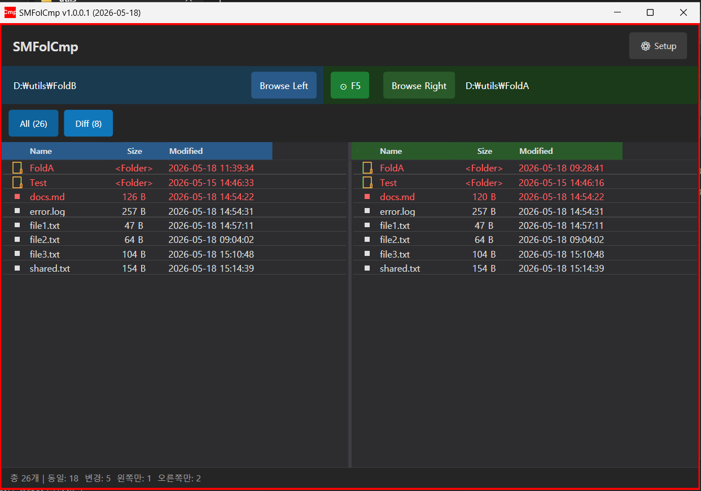

# SMFolCmp

SMFolCmp는 Windows에서 폴더와 텍스트 파일을 비교하는 데스크톱 애플리케이션입니다.

## 메인 화면



## 주요 기능

- 폴더 간 파일 비교
- 왼쪽 전용, 오른쪽 전용, 내용 변경, 날짜만 변경 상태 표시
- 폴더 트리 확장 및 차이 항목 필터링
- 파일 복사 및 삭제
- 텍스트 파일의 좌우 비교
- 파일 비교창에서 `All` / `Diff` 전환
- 파일 비교창에서 복사, 붙여넣기, 삭제, 삽입, 편집, 저장
- Windows 탐색기 컨텍스트 메뉴 연동

## 화면 구성

### 폴더 비교창

- `Browse Left`: 왼쪽 폴더 선택
- `Browse Right`: 오른쪽 폴더 선택
- `Compare`: 폴더 다시 비교
- `All`: 전체 항목 표시
- `Diff`: 차이가 있는 항목만 표시

비교 결과는 다음 상태로 표시됩니다.

| 상태 | 의미 |
| --- | --- |
| `Identical` | 양쪽 내용이 동일 |
| `Date Only` | 파일 크기와 내용은 같고 수정 날짜만 다름 |
| `Modified` | 파일 내용이 다름 |
| `Left Only` | 왼쪽에만 존재 |
| `Right Only` | 오른쪽에만 존재 |

### 파일 비교창

- `All`: 전체 줄 표시
- `Diff`: 다른 줄만 표시
- `Copy to Right` / `Copy to Left`: 선택 줄 복사
- `Insert`: 선택 위치에 빈 줄 삽입
- `Save Left` / `Save Right`: 각 파일 저장
- `F2`: 선택 줄 편집
- `Enter`: 편집 적용
- `Alt + Enter`: 편집창에서 줄바꿈
- `Ctrl + C` / `Ctrl + V`: 선택 줄 복사 및 붙여넣기
- `Delete`: 선택 줄 삭제

## 실행 방법

```powershell
.\SMFolCmp.exe
```

## 기본 사용법

1. 프로그램을 실행합니다.
2. 왼쪽 폴더와 오른쪽 폴더를 선택합니다.
3. `Compare`를 눌러 비교합니다.
4. 차이가 있는 파일을 더블 클릭하면 파일 비교창이 열립니다.

## 탐색기 컨텍스트 메뉴

앱의 `Setup` 화면에서 컨텍스트 메뉴를 등록할 수 있습니다.

- 파일 또는 폴더 1개 선택 시:
  - `SMFolCmp with Left`
  - `SMFolCmp and Compare`
- 파일 또는 폴더 2개 선택 시:
  - `-SMFolCmp`

두 항목을 선택한 상태에서 `-SMFolCmp`를 누르면 바로 비교가 시작됩니다.

## 빌드

```powershell
dotnet build
```

또는 프로젝트에 포함된 빌드 스크립트를 사용할 수 있습니다.

```powershell
.\build.ps1
```

## 프로젝트 구조

```text
SMFolCmp/
|-- App.xaml
|-- App.xaml.cs
|-- Models/
|   `-- FileItem.cs
|-- Views/
|   |-- MainWindow.xaml
|   |-- MainWindow.xaml.cs
|   |-- CompareWindow.xaml
|   |-- CompareWindow.xaml.cs
|   |-- SetupWindow.xaml
|   `-- SetupWindow.xaml.cs
|-- SMFolCmp.csproj
|-- README.md
`-- copy-to-utils.ps1
```

## 참고

- 폴더 비교 결과에서 `Date Only`는 파일 내용은 같고 수정 날짜만 다른 경우입니다.
- 파일 비교창의 마지막 `All` / `Diff` 선택 상태는 다음 실행 때 복원됩니다.
- 비교창에서 수정한 내용은 `Save Left`, `Save Right`, 또는 `Ctrl + S`로 실제 파일에 저장해야 합니다.
